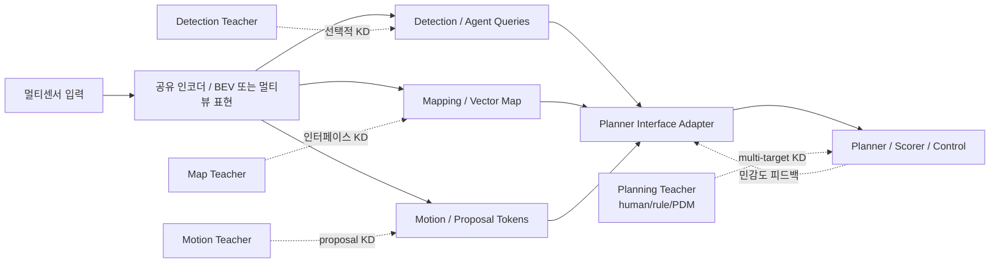

# 모듈별 Teacher KD를 활용한 End-to-End 자율주행 연구 방향 재정의 보고서

## Executive Summary

현재 연구제안서의 핵심 축은 분명하다. 첫째, **planning만 잘하는 블랙박스 E2E 모델**이 아니라 detection, mapping, motion prediction 같은 **auxiliary task를 내부에 유지하는 E2E 모델**을 전제로 한다는 점, 둘째, 각 모듈에 대해 **전문 teacher를 두는 모듈별 knowledge distillation**로 성능을 끌어올리려 한다는 점, 셋째, 최종적으로는 **제한된 데이터와 GPU 환경에서**도 성능을 확보하고자 한다는 점이다. 제안서에는 이미 저자원 환경, 사전학습된 E2E 모델의 개선, 모듈별 teacher 정렬, 그리고 통합 증류 전략 도출이 명시돼 있다. fileciteturn0file0

문헌을 종합하면, 이 연구 방향에서 **가장 설득력 있는 다음 단계**는 gradient surgery를 더 밀어붙이는 것이 아니라, **planner-sensitive interface distillation**과 **stage-wise module incubation**으로 연구 프레임을 옮기는 것이다. 이유는 간단하다. 최근 E2E 자율주행 문헌은 auxiliary task가 planning에 “기여하는 방식”이 중요하다고 말한다. UniAD는 planning-oriented 철학과 unified query interface를 내세웠고, VAD는 vectorized map/agent 표현을 planning constraint로 직접 사용해 안전성과 효율을 함께 끌어올렸다. Hydra-MDP는 더 나아가 planning을 하나의 scalar target으로 distill하는 것보다 **다중 평가 타깃을 따로 distill**하는 쪽이 낫다는 점을 보여준다. 즉, “모든 보조 과업을 다 잘 맞추는 것”보다 “planning에 실질적으로 영향을 주는 인터페이스를 잘 맞추는 것”이 더 중요하다는 신호가 강하다. citeturn0search2turn0search1turn21academia34turn21search3

반대로, gradient conflict 해결을 위한 일반적인 MTL/MOO 계열 기법은 대규모 자율주행 E2E 모델에서 비용 대비 효익이 애매하다. FAMO가 지적하듯 기존 gradient manipulation 계열은 여러 task gradient를 직접 저장·계산해야 해 대규모 시나리오에서 부담이 크고, 실제로 당신이 겪은 “메모리는 많이 먹는데 성능 이득은 작다”는 경험과 일치한다. 더 근본적으로는, “MTL task conflict” 자체가 작은 benchmark에서 관찰된 현상인지, expressive한 대형 모델에서도 본질적인지조차 불명확하다. 실제로 “Multi-task problems are not multi-objective”는 충분히 expressive한 단일 모델에서는 전형적 MTL을 MOO로 보는 해석 자체가 빗나갈 수 있다고 주장한다. 따라서 지금 문제는 “gradient conflict를 잘 푸는 법”보다 먼저, **무엇을 실제로 distill해야 planning이 좋아지는가**를 재정의하는 쪽이 맞다. citeturn4academia41turn23academia24turn4search1

저자원 동기도 부분적으로는 타당하지만, 그대로 두면 논리적으로 약하다. KD 일반론과 DistilBERT류 연구는 distillation이 **작은 학생 모델의 성능 보존**, **사전학습 비용 절감**, **배포 효율 개선**에는 확실히 유효하다고 말한다. 그러나 자율주행에서 **multi-teacher module-wise KD는 학습 중 teacher 추론, target caching, alignment head**가 추가되므로, “총 학습 FLOPs가 무조건 줄어든다”는 주장은 곧바로 성립하지 않는다. 따라서 이 연구의 저자원 motivation은 “학습 전체 비용 절감”보다 **데이터 효율 향상**, **라벨 효율 향상**, **작은/중간 student의 성능 상한 확장**, 그리고 **teacher target의 offline precompute를 전제로 한 실질적 GPU 사용 최적화**로 다시 쓰는 것이 더 안전하다. citeturn9search2turn7academia48turn8search1

이 보고서의 최종 권고는 다음과 같다. **주력 연구 방향은 planner-aware interface KD**, **보조 축은 stage-wise module incubation**, **저자원 설계는 selective KD와 offline teacher caching**, **loss weighting은 baseline/보조 최적화 수단으로만 제한**하는 것이 가장 합리적이다. 참고 수준에서 uncertainty weighting, DWA, 그리고 대규모에서 상대적으로 값싼 FAMO를 살펴보되, 연구의 중심 가설은 어디까지나 **“planning에 유의미한 representations만 골라 distill하면, 크고 복잡한 E2E 모델에서도 KD의 가성비가 나온다”**로 두는 것이 좋다. citeturn2search0turn6search0turn5search3turn4academia41turn0search0

## 문제 정의와 motivation의 재구성

당신의 현재 문제를 가장 정확히 표현하면 이렇다. **“모듈이 있는 E2E 자율주행 모델에서 auxiliary task supervision을 어떻게 넣어야 planning이 실제로 좋아지는가”**가 본질이다. 많은 E2E 자율주행 연구가 perception, mapping, prediction, planning을 동시에 다루지만, 단순히 auxiliary head를 붙이는 것과 **planner가 그 정보를 실제로 ‘쓰게’ 만드는 것**은 다르다. UniAD는 task들이 unified query interface를 통해 planning으로 연결돼야 한다고 주장했고, VAD는 agent trajectory와 map element를 완전 vectorized scene representation으로 만들어 planner에 explicit constraint처럼 작동시키며 성능과 속도를 함께 개선했다. 이는 auxiliary task의 존재 자체보다 **planner-facing representation 설계**가 중요함을 시사한다. citeturn0search2turn0search1

왜 지금 이 문제가 다시 중요해졌는가. 최근 E2E 자율주행은 단순 imitation을 넘어서, closed-loop robustness, multi-modality, reasoning, world modeling으로 빠르게 이동하고 있다. E2E 자율주행 전반을 다룬 TPAMI survey는 multi-modality, interpretability, causal confusion, robustness, world models를 핵심 도전 과제로 정리한다. Bench2Drive는 기존 open-loop L2/collision 중심 평가만으로는 실주행 성능을 제대로 반영하지 못한다고 지적했고, NAVSIM은 data-driven pseudo-simulation benchmark로 closed-loop에 좀 더 가까운 planning 평가 환경을 제공한다. 즉, 이제는 “auxiliary task loss가 잘 내려갔다”보다 **실제 planning 및 closed-loop 지표가 좋아졌는가**가 더 중요해졌다. citeturn10academia42turn15academia28turn14search4

여기서 “왜 gradient surgery가 중심이 아니어야 하는가?”라는 질문을 계속 던져보면 답이 선명해진다. 첫 번째 왜. **왜 conflict를 푸는 것보다 interface를 재설계하는 게 먼저인가?** conflict는 결국 여러 손실이 공유 파라미터를 두고 끌어당기는 현상인데, planner가 실제로 필요로 하지 않는 보조 표현까지 모두 공유 백본에 밀어 넣으면 conflict는 당연히 커진다. 두 번째 왜. **왜 대형 E2E 모델에서 toy-scale MTL 결과가 안 맞는가?** expressive한 모델에서는 task가 정말로 충돌하는지, 아니면 단지 표현 공간이 커져서 작은 benchmark의 MOO 직관이 무너지는지 불분명하다. 세 번째 왜. **왜 debugging이 어려운가?** 자율주행 E2E는 BEV encoder, temporal fusion, query decoder, planner head, simulation metric까지 얽혀 있어 “gradient angle” 하나로 원인을 분리하기 어렵다. 결국 당신이 경험한 문제는 gradient surgery를 더 정교하게 하라는 신호가 아니라, **문제를 representation/interface 수준으로 다시 정의하라**는 신호에 가깝다. citeturn23academia24turn4academia41turn4search1

저자원 motivation도 같은 방식으로 다시 따져야 한다. **왜 KD를 저자원 해법으로 여겼는가?** teacher의 더 좋은 inductive bias를 student에 전이하면 적은 데이터나 작은 모델에서도 성능을 유지할 수 있기 때문이다. **왜 이 논리가 자율주행에서는 약해질 수 있는가?** multi-teacher KD는 학습 과정 자체는 무거워질 수 있어서, 전체 연구비/GPU 시간 관점의 “저자원”과 반드시 일치하지 않기 때문이다. **그럼에도 왜 여전히 살릴 수 있는가?** teacher 출력을 offline으로 캐시하고, planner에 실질적으로 필요한 일부 representation만 selective하게 distill하면, 전체 학습 비용은 관리하면서 student의 데이터 효율과 최종 추론 효율을 함께 얻을 수 있기 때문이다. 따라서 저자원 motivation은 버릴 필요는 없지만, **“학습 자체가 더 싸다”가 아니라 “같은 자원에서 더 나은 student를 만든다”**로 바꾸는 것이 정확하다. fileciteturn0file0 citeturn9search2turn7academia48turn8search1

## 문헌이 말하는 핵심 신호와 방향 전환의 근거

가장 먼저 봐야 할 신호는 **planner-oriented auxiliary integration**이다. UniAD는 perception, prediction, occupancy, planning 등 전 stack의 과업을 한 네트워크에 넣되, planning을 최종 목표로 놓고 unified query interfaces로 task communication을 설계했다. VAD는 dense raster 대신 fully vectorized representation을 도입해 map element와 agent motion을 planner의 explicit constraint로 활용했고, 이전 SOTA 대비 collision rate를 크게 낮추면서도 더 빠른 추론을 보여줬다. 이 두 연구는 공통적으로 “auxiliary task를 붙여라”가 아니라 **“planning에 의미 있는 형식으로 auxiliary 정보를 넘겨라”**를 말한다. 이는 module-wise KD를 하더라도 **feature map 전체를 맞추는 방식보다 planner가 읽는 인터페이스를 맞추는 방식이 더 설득력 있다**는 근거가 된다. citeturn0search2turn0search1

두 번째 신호는 **multi-target planning distillation**이다. Hydra-MDP는 human teacher와 rule-based teacher를 함께 사용해 trajectory candidate를 여러 평가 축으로 distill했고, Navsim challenge에서 강한 성능을 보였다. 특히 Hydra-MDP 관련 공개 요약은 **단일 aggregated score를 distill하면 성능이 떨어지고**, NC, DAC, TTC, Comfort, Ego Progress 같은 세부 축으로 나눠 distill해야 성능이 낫다고 강조한다. 이는 당신의 setting에서 매우 중요하다. detection, mapping, motion prediction teacher를 각각 두더라도, 결국 planner 쪽 supervision을 하나의 종합 trajectory loss로만 누르면 teacher 정보가 뭉개질 수 있다. 즉, **module별 teacher는 planner 쪽에서도 “다중 인터페이스·다중 기준”으로 이어져야 한다**는 뜻이다. citeturn21academia34turn21search1turn21search3

세 번째 신호는 **대형 모델은 simultaneous E2E joint training보다 stage-wise divide-and-conquer가 유리할 수 있다**는 점이다. Deep Incubation은 큰 모델을 작은 sub-module로 나눠 학습한 뒤 assembly하는 divide-and-conquer 방식이 end-to-end training보다도 나을 수 있음을 보여준다. 이 아이디어는 자율주행 E2E에 직접 적용된 것은 아니지만, 당신의 문제 구조와 아주 잘 맞는다. 지금의 병목은 “모든 모듈을 동시에, 모든 task를 동시에, teacher도 동시에” 학습시키는 데서 오는 최적화 복잡성이다. 그렇다면 module-wise KD를 하되, **초기에는 분리된 sub-module 적응**, 이후에 **planner-aware joint fine-tuning**으로 넘어가는 구조가 gradient surgery보다 훨씬 직접적인 대안이 된다. citeturn0search0

네 번째 신호는 **큰 모델에서 검증된 distillation interface는 attention/token/representation 수준에서 더 효과적일 수 있다**는 점이다. DeiT는 86M 파라미터급 ViT에서 distillation token을 통해 attention 기반 teacher-student 연결을 설계했고, 대규모 인프라 없이도 강한 성능을 만들었다. 최근 자율주행 VLM 쪽 Drive-KD도 perception–reasoning–planning triad를 나누고 layer-specific attention을 distillation 신호로 사용해, 작은 student가 훨씬 큰 teacher에 비해 메모리와 throughput에서 유리하면서도 경쟁력 있는 성능을 보였다고 보고한다. 즉, **대형 transformer/attention 계열에서 검증된 인터페이스 distillation**은 자율주행 E2E에도 충분히 가져올 만하다. citeturn7search1turn12academia33

다섯 번째 신호는 **최근 E2E 자율주행이 representation과 planning을 더 강하게 결합하는 방향으로 가고 있다**는 것이다. EMMA는 planner trajectories, object detection, road graph elements를 한 language space에서 함께 학습해 여러 도메인에서 동반 향상을 보였지만, 동시에 계산 비용과 frame 수 제한 문제도 드러냈다. PRIX는 camera-only, no explicit BEV, no LiDAR라는 극단적으로 효율 지향적인 설계를 통해 planning 성능을 확보하려 했고, Hydra-NeXt는 trajectory/control/refinement의 다중 planning branch로 open-loop와 closed-loop 간 간극을 줄였다. 최근 Drive-JEPA는 V-JEPA 기반 video pretraining에 multimodal trajectory distillation을 결합해 NAVSIM에서 강한 성능을 보고했다. 이 흐름은 결국 연구 질문을 하나로 수렴시킨다. **KD의 대상은 auxiliary task 자체가 아니라, planning에 유효한 표현과 선택 구조여야 한다.** citeturn11academia24turn1academia48turn1search0turn12search0turn19academia22

아래 표는 현재 시점에서 직접 검토할 가치가 높은 관련 축을 정리한 것이다.

| 축 | 대표 근거 | 대형 모델/실전성 신호 | 당신의 연구에 주는 메시지 |
|---|---|---|---|
| Planning-oriented multi-task integration | UniAD, VAD citeturn0search2turn0search1 | E2E AD 핵심 SOTA 계열 | auxiliary를 달더라도 planner-facing interface가 핵심 |
| Multi-target planning KD | Hydra-MDP, Hydra-MDP++ citeturn21academia34turn21academia35 | challenge 성능·경량 backbone 확장 사례 | planning supervision을 하나로 뭉개지 말고 축별로 분리 |
| Divide-and-conquer large model training | Deep Incubation citeturn0search0 | large model 학습 직접 검증 | gradient surgery 대신 module incubation 가능 |
| Attention/token distillation | DeiT, Drive-KD citeturn7search1turn12academia33 | 86M ViT, 1B–78B VLM 계열 | dense feature KD보다 query/token KD가 실용적 |
| Self-supervised predictive representation | V-JEPA 2, Drive-JEPA citeturn19academia22turn12search0 | web-scale video, planning transfer | KD 전에 encoder 자체를 planning-friendly하게 만들 수 있음 |
| Closed-loop robustness emphasis | Bench2Drive, Hydra-NeXt citeturn15academia28turn1search0 | open-loop 한계 보완 | ablation 종착점은 planning L2가 아니라 closed-loop여야 함 |

## 권고 연구 방향

### Planner-sensitive interface distillation

이 보고서의 **최우선 권고안**은 planner-sensitive interface distillation이다. 핵심 가설은 단순하다. **“전체 auxiliary module의 출력을 많이 맞추는 것”이 아니라, “planner가 실제로 소비하는 형태로 표현을 맞추는 것”이 성능/비용 비율이 좋다**는 것이다. VAD는 vectorized agent/map 표현을 explicit planning constraint로 쓰며 효율과 안전성을 동시에 얻었고, UniAD는 query interface 자체를 task communication의 중심으로 둔다. MapTRv2와 Mask2Map은 vectorized HD map을 더 안정적이고 빠르게 만들었고, DeMo++는 motion forecasting/planning/E2E planning 전반에서 강한 표현을 보인다. 그렇다면 module-wise KD의 이상적인 대상도 dense BEV 전체가 아니라, **vector map polylines, agent queries, motion proposal tokens, planner-scoring heads** 같은 interface여야 한다. citeturn0search1turn0search2turn17academia27turn16academia45turn16academia44

왜 이 방향이 좋은가. **왜 feature map 전체를 distill하지 않는가?** 메모리와 정렬 비용이 크고, planner가 실제로 쓰지 않는 채널까지 강제로 맞추게 되기 때문이다. **왜 interface를 distill하는가?** planner의 downstream sensitivity가 큰 표현에 teacher 정보를 집중할 수 있기 때문이다. **왜 planner-sensitive여야 하는가?** 같은 detection 정보라도 planner에 중요한 agent와 아닌 agent가 다르며, 같은 map 정보라도 centerline/topology와 시각적 디테일의 중요도는 다르기 때문이다. Hydra-MDP의 결과는 planning 쪽 supervision도 다양한 축으로 쪼개야 유리하다는 점을 보여주므로, upstream auxiliary KD 역시 **planner relevance를 기준으로 가중·선별**하는 것이 더 논리적이다. 이것은 문헌을 종합한 설계 추론이지만, planning-oriented 자율주행의 최근 흐름과 정합적이다. citeturn21academia34turn21search3turn0search2turn0search1

아래 도식은 이 방향의 직관을 보여준다.



실험적으로는 detection teacher에서 **planner가 반응하는 상위 K개 agent query**만 distill하고, mapping teacher에서는 **centerline, lane boundary, lane topology처럼 planner에 직접 쓰이는 vector map**을 우선 distill하며, motion teacher에서는 **trajectory proposal의 multimodality와 score/rank**를 distill하는 구성이 적합하다. attention map이나 intermediate representation은 보조로만 쓰고, 기본은 “planner가 소비하는 인터페이스”에 둬야 한다. DeiT와 Drive-KD가 attention/token 수준 distillation의 실효성을 보여준 만큼, 자율주행에서도 **dense feature imitation보다 query/token imitation**이 먼저 실험되어야 한다. citeturn7search1turn12academia33turn17academia27turn16academia45turn16academia44

### Stage-wise module incubation distillation

두 번째 권고안은 stage-wise module incubation이다. 이것은 사실상 **gradient surgery를 “우회”하는 전략**이다. 모든 task와 모든 teacher를 동시에 joint training하면, 어떤 task가 어느 stage에서 누구를 방해하는지 해석이 어려워진다. Deep Incubation은 큰 모델을 나눠 학습하고 조합하는 방식이 단순 E2E training보다 나을 수 있음을 보여줬다. 이를 자율주행 E2E에 가져오면, 먼저 **공유 encoder와 각 auxiliary head를 teacher-aligned 상태로 부분 적응**시키고, 그 다음 planner-aware integration을 수행하며, 마지막에 아주 약한 joint KD만 남기는 구조가 된다. citeturn0search0

왜 이 방향이 필요한가. **왜 동시에 하지 않는가?** 동시학습은 최적화 요인이 너무 많아 실패 원인 분리가 어렵다. **왜 module incubation이 맞는가?** 당신의 연구는 원래부터 모듈별 teacher를 전제하기 때문이다. 즉, 문제 구조와 방법론이 자연스럽게 맞아떨어진다. **왜 이것이 대형 모델에 더 적합한가?** 작은 MTL benchmark에서 의미 있는 gradient geometry가 거대한 BEV–Transformer–Planner 모델에서는 사라지거나 왜곡될 수 있기 때문이다. 단계적 적응은 최소한 “어느 teacher가 어느 표현을 개선했는가”를 실험적으로 해석할 수 있게 만든다. citeturn23academia24turn0search0

권장 파이프라인은 다음과 같다. 첫 단계에서는 baseline E2E를 재현하고 planner 성능과 auxiliary head의 baseline을 확보한다. 두 번째 단계에서는 detection/map/motion teacher target을 offline cache로 구성한다. 세 번째 단계에서는 각 모듈을 개별 teacher에 맞춰 **짧고 강하게** 정렬한다. 네 번째 단계에서는 planner 앞의 adapter/interface만 joint fine-tune한다. 마지막 단계에서만 약한 end-to-end KD와 planner multi-target KD를 함께 사용한다. 이 과정은 joint-from-scratch보다 계산량이 늘어날 수 있지만, failure mode 해석 가능성과 memory control 면에서 훨씬 낫다. 이는 “학습이 싸다”가 아니라 “실패를 빨리 분리하고, 큰 모델에서도 증류가 통하는지 검정할 수 있다”는 점에서 연구비용을 줄인다. citeturn0search0turn9search2


### Selective low-resource KD

세 번째 방향은 low-resource motivation을 버리는 대신 **정교하게 축소하는 것**이다. 현재 proposal은 “제한된 데이터와 GPU 환경에서도”를 전면에 둔다. 다만 실제 문헌을 보면 KD의 주된 강점은 보통 **배포 효율**과 **작은 student의 성능 보전**이다. DistilBERT는 pretraining 단계 distillation으로 40% smaller, 60% faster를 보였지만, 이는 teacher 설계와 사전학습 파이프라인이 잘 짜여 있었기 때문에 가능한 결과다. 자율주행의 multi-teacher module KD는 더 무겁다. 따라서 저자원 가설은 “전체 teacher를 항상 돌린다”가 아니라 **selective distillation**로 재설계하는 편이 맞다. fileciteturn0file0 citeturn7academia48turn9search2turn8search1

왜 selective해야 하는가. **왜 모든 샘플을 distill하면 안 되는가?** 쉬운 normal driving 장면까지 강하게 distill하면 teacher 비용만 늘고 정보밀도는 낮다. **왜 어려운 장면만 distill하는가?** long-tail, near-collision, map ambiguity, crowded interaction, navigation compliance failure 같은 장면에서 teacher의 정보가 더 값지기 때문이다. **왜 이것이 저자원과 연결되는가?** 적은 데이터/적은 GPU에서 가장 중요한 것은 평균적인 장면을 더 보는 것이 아니라, **성능을 깨뜨리는 장면을 더 효율적으로 학습하는 것**이기 때문이다. Bench2Drive는 상호작용 시나리오와 다양한 환경을 분리 평가하도록 설계되어 있어, 이러한 selective KD의 효과를 보기 좋은 benchmark다. citeturn15academia28turn11academia24

구체적으로는 teacher confidence, planner sensitivity, scenario rarity를 함께 써서 distillation mask를 만드는 것이 좋다. 예를 들어 detection teacher는 **planner가 주시하는 agent**이면서 teacher confidence가 높은 것만, map teacher는 **route 근처 centerline/topology**만, motion teacher는 **ego와 충돌 가능성이 높은 proposal space**만 선택적으로 distill한다. 이는 지식 amalgamation이나 adaptive amalgamation 계열에서 제안된 “가장 ambiguity가 낮은 teacher를 sample별로 선택”하는 사고와도 닿아 있다. 자율주행에 그대로 옮긴 사례는 많지 않지만, multi-teacher reuse 분야에서는 충분히 검증된 방향이다. citeturn24academia27turn24academia32turn24academia29

## 모듈별 KD 설계 레시피

### 언제 distill할 것인가

가장 실용적인 기본값은 **pretrain-style short incubation + planner-aware fine-tuning + optional online weak KD**의 3단계다. Hinton의 고전적 KD와 DistilBERT는 초기 학습 단계에서 teacher distribution을 활용해 inductive bias를 주입하는 접근이 강력함을 보여준다. 반면 DeiT, Drive-KD, 그리고 최근 planner/LM distillation 연구는 fine-tuning이나 attention-level alignment도 효과적임을 시사한다. 따라서 자율주행에서는 “언제나 online mutual distillation”보다 **초기 표현 정렬은 강하게, 후반은 planner-target 정렬 위주로 약하게** 가는 편이 안전하다. citeturn8search1turn7academia48turn7search1turn12academia33turn12academia36

권장 스케줄은 이렇다. **초기 20–30% 학습 구간**에서는 detection/map teacher의 representation/interface KD를 상대적으로 강하게 준다. 이 시점은 shared encoder가 scene grammar를 잡는 단계이기 때문이다. **중기 30–70% 구간**에서는 motion teacher와 planning-adjacent representation KD의 비중을 높인다. 이때 planner가 주변 상호작용을 익히기 시작한다. **후기 70–100% 구간**에서는 planning teacher의 multi-target KD를 강화하되, 상위 perception/map KD는 서서히 감쇠한다. 이는 auxiliary가 planner를 돕게 하되 planner를 덮어쓰지 않도록 하기 위한 설계다. 이 스케줄 자체는 제안이지만, planning-oriented E2E와 multi-target KD 문헌의 구조와 잘 맞는다. citeturn0search2turn21academia34turn1search0

### 어디를 distill할 것인가

전부 distill하지 말고, 아래 네 지점을 우선순위로 삼는 것이 좋다.

| 모듈 | 1순위 distillation 위치 | 2순위 distillation 위치 | 이유 | 추천 teacher 예시 |
|---|---|---|---|---|
| Detection | object/agent queries, class logits, box/velocity outputs | planner-relevant attention map | planner가 결국 agent-level query를 소비하기 쉬움 | 강한 3D detector, EMMA-style object teacher citeturn11academia24turn13search2 |
| Mapping | vector polylines, centerline, topology, lane boundaries | BEV segmentation mask | planner에 직접 쓸 수 있는 지도 형식 | MapTRv2, Mask2Map citeturn17academia27turn16academia45 |
| Motion | trajectory proposals, proposal score/rank, occupancy proxy | latent motion token | planning과 가장 직접적으로 연결 | DeMo++ citeturn16academia44 |
| Planning | candidate ranking, PDM-like sub-metric heads, short-horizon control | final waypoint logits | aggregate score보다 multi-target이 유리 | Hydra-MDP, Hydra-NeXt citeturn21academia34turn1search0 |

이 표의 핵심은 한 문장으로 요약된다. **“raw feature보다 interface를 먼저 맞춰라.”** MapTRv2와 Mask2Map은 vectorized map을, VAD는 vectorized scene representation을, Hydra-MDP는 metric-aware candidate scoring을, Drive-KD는 attention-level capability transfer를 보여준다. 이는 자율주행 E2E의 distillation 포인트가 dense tensor보다 **구조화된 query/vector/score space**에 있을 가능성이 높다는 뜻이다. citeturn17academia27turn16academia45turn0search1turn21academia34turn12academia33

### 얼마나 distill할 것인가

KD 강도는 정적으로 두지 말고 **task별·시기별로 스케줄링**하는 편이 좋다. uncertainty weighting은 손실 스케일을 학습 가능한 형태로 조정하고, DWA는 최근 학습 속도 비율에 따라 task weight를 바꾸며, FAMO는 대규모 환경에서 O(1) 공간·시간으로 균형 잡힌 손실 감소를 지향한다. 이것들을 그대로 “최종 연구 아이디어”로 삼을 필요는 없지만, KD 강도를 조정하는 도구로 쓰기에는 적합하다. 가장 현실적인 시작점은 **static schedule + uncertainty weighting**, 그 다음이 **DWA**, task 수가 늘면 **FAMO**다. citeturn2search0turn5search3turn4academia41

실무 기본값으로는 detection/map KD의 초기 가중치를 상대적으로 높게 두고, epoch 진행에 따라 감쇠하는 **cosine decay**가 안전하다. motion/planning KD는 중기 이후에 ramp-up하고, 최종 planner multi-target KD는 마지막까지 유지한다. temperature는 classification/logit KD에는 2–4 범위에서 시작하고, DWA를 쓴다면 구현 관행상 T=2.0이 무난하다. 다만 이 수치는 문헌의 엄격한 최적값이라기보다 시작점이다. 당신의 연구에서는 오히려 `KD on/off`, `static vs dynamic`, `early-only vs all-stage`의 상대 비교가 더 중요하다. citeturn8search1turn5search3turn2search0

### Planner-aware interface의 형태

planner-aware interface는 네 가지 패턴으로 정리할 수 있다.

| 패턴 | 표현 형식 | 장점 | 단점 | 적합도 |
|---|---|---|---|---|
| Shared BEV + vector queries | BEV 위 query/token | 기존 VAD/UniAD 계열과 호환성 높음 | dense backbone 비용 존재 | 현재 연구에 가장 적합 citeturn0search2turn0search1 |
| Vector map + trajectory proposal | polyline + proposal set | planner와 직접 연결, KD 경제적 | query matching 설계 필요 | 매우 높음 citeturn17academia27turn16academia45turn16academia44 |
| Multi-head scoring planner | NC/DAC/TTC 등 metric heads | aggregate target보다 해석 가능 | metric teacher 준비 필요 | planning teacher에 적합 citeturn21academia34turn21search3 |
| Text / language interface | natural language I/O | reasoning·generalization 장점 | 계산량·지연 큼 | 현재 BEV E2E에는 보조 비교축 정도 citeturn11academia24turn11search0 |

내 판단으로는, **당장 가장 연구 논문으로 만들기 좋은 인터페이스는 “vector map + agent/motion proposal + planner metric heads” 조합**이다. 이유를 다시 묻자. **왜 VLM/text interface가 아닌가?** 최신성이 높지만 현재 네 연구자산과의 구조적 연속성이 약하고 계산비용이 크다. **왜 dense BEV 전체 imitation이 아닌가?** 구현은 쉬워도 메모리 이득이 거의 없고 planner relevance가 희박하다. **왜 vector/proposal/metric 조합인가?** 현재 E2E AD 문헌에서 planning으로 이어지는 구조가 이미 검증된 표현이며, module-wise teacher와도 가장 자연스럽게 연결되기 때문이다. citeturn0search1turn0search2turn21academia34turn11academia24

## Loss weighting과 타 분야 아이디어의 실질적 활용도

loss weighting은 당신이 말한 대로 **주아이디어라기보다 참고 축**으로 보는 것이 맞다. uncertainty weighting은 task의 homoscedastic uncertainty를 학습해 서로 다른 단위/스케일의 손실을 자동으로 조정하는 고전적 방법이고, MTAN은 task-specific attention을 도입하면서 weighting에 상대적으로 덜 민감한 구조를 보였다. DWA는 최근 epoch의 loss 감소 속도를 이용해 가중치를 정하는 사실상 **convergence-aware** 방식이고, DTP는 어려운 task를 우선하도록 학습 중 우선순위를 바꾼다. GradNorm은 gradient magnitude를 정규화해 task training rate를 맞추며, FAMO는 이런 계열의 비용 문제를 줄여 O(1) 시간·공간으로 균형 잡힌 최적화를 시도한다. citeturn2search0turn6search0turn20search0turn2search8turn4academia41

하지만 왜 이걸 중심 아이디어로 삼지 말아야 하는가. **왜 uncertainty/DWA 정도만 쓰는 게 좋은가?** 구현이 쉽고 memory overhead가 작기 때문이다. **왜 GradNorm/FAMO도 보조 축인가?** 손실 균형을 맞춘다고 planner가 좋아진다는 보장은 없고, 본질적인 representation/interface 문제가 해결되지 않기 때문이다. **왜 gradient surgery보다는 낫다고 보나?** 적어도 loss weighting은 architecture와 data flow를 크게 건드리지 않고, 빠른 baseline으로서 가치가 있기 때문이다. 따라서 추천 baseline 세트는 `static`, `uncertainty`, `DWA`, 그리고 task 수가 많을 때 `FAMO` 정도면 충분하다. citeturn2search0turn5search3turn4academia41

아래는 실제 활용 관점의 비교다.

| 방법 | 추가 하이퍼파라미터 | 메모리/계산 비용 | 대형 모델 스케일성 | 장점 | 한계 |
|---|---|---:|---|---|---|
| Static manual weights | 매우 적음 | 매우 낮음 | 매우 높음 | baseline 해석이 쉬움 | tuning 번거로움 |
| Uncertainty weighting | task별 log-variance | 낮음 | 높음 | 스케일 다른 losses에 강함 | planner relevance는 반영 안 됨 citeturn2search0 |
| DWA | temperature T | 매우 낮음 | 높음 | loss 감소율 기반, 구현 쉬움 | noisy loss에 민감할 수 있음 citeturn5search3turn6search0 |
| DTP | difficulty 관련 설정 | 낮음 | 보통 | 어려운 task 강조 | difficulty 정의가 민감 citeturn20search0 |
| GradNorm | α | 보통 | 보통 | task training rate 직접 제어 | task gradient 계산 필요 citeturn2search8 |
| FAMO | 소수 | 낮음 | 높음 | O(1) space/time, large-scale 친화 | planner-aware는 아님 citeturn4academia41 |

타 분야 아이디어 중 실제로 가져올 가치가 높은 것은 따로 있다. 첫째는 **Deep Incubation식 divide-and-conquer**다. 이건 바로 자율주행 E2E large model에 없는 빈칸을 메운다. 둘째는 **DeiT식 attention/token distillation**이다. dense feature matching보다 훨씬 경제적일 수 있다. 셋째는 **knowledge amalgamation / adaptive teacher selection**이다. 여러 heterogeneous teacher를 두는 네 setting과 구조적으로 잘 맞는다. 넷째는 **V-JEPA 2 같은 predictive self-supervised pretraining**이다. 자율주행에 이미 Drive-JEPA가 이를 trajectory distillation과 결합해 좋은 결과를 보였기 때문에, “KD만”이 아니라 **encoder를 먼저 planning-friendly하게 만드는 전처리 단계**로 검토할 가치가 있다. 다섯째는 planner head 한정으로 **on-policy distillation**이다. 최근 motion planning LLM 연구는 on-policy GKD가 훨씬 큰 teacher에 근접할 수 있음을 보인다. 이것은 장기적으로 generative planner나 VLA 계열로 넘어갈 때 유용한 레퍼런스다. citeturn0search0turn7search1turn24academia27turn24academia32turn19academia22turn12search0turn12academia36

## 권장 실험 설계와 다음 단계

가장 중요한 실험 원칙은 하나다. **실험의 축을 “task conflict 해소 여부”가 아니라 “planner에 도움이 되는 방식으로 teacher를 심었는가”로 바꿔야 한다.** 데이터셋 제약이 없다고 했으므로, open-loop는 nuScenes 계열, pseudo-simulation은 NAVSIM, closed-loop는 Bench2Drive를 기본 삼는 것이 가장 설득력 있다. nuScenes는 detection과 prediction 측면의 공개 지표가 잘 정리돼 있고, NAVSIM은 E2E planning benchmark로 자리 잡았으며, Bench2Drive는 open-loop 한계를 넘어 다양한 상호작용 시나리오에서 multi-ability closed-loop 평가를 제공한다. citeturn13search2turn13search4turn14search4turn15academia28

권장 실험 매트릭스는 다음과 같다. 첫 번째 축은 **distill location**이다. `feature map`, `query/token`, `final logit`, `attention map`, `vector interface`를 비교한다. 두 번째 축은 **distill timing**이다. `pretrain-only`, `finetune-only`, `stage-wise`, `all-stage`를 비교한다. 세 번째 축은 **teacher granularity**다. `single-module teacher`, `all-modules independent`, `all-modules + planner teacher`를 비교한다. 네 번째 축은 **selection policy**다. `all-sample KD`, `teacher-confidence KD`, `planner-sensitive KD`, `long-tail-only KD`를 비교한다. 다섯 번째 축은 **objective control**이다. `static`, `uncertainty`, `DWA`, `FAMO`를 baseline으로 놓는다. 이렇게 해야 “KD가 먹히는가?”가 아니라 **“어떤 인터페이스, 어떤 시점, 어떤 샘플에서 먹히는가?”**를 논문으로 만들 수 있다. citeturn2search0turn5search3turn4academia41turn21academia34

평가 지표는 planning과 auxiliary를 함께 보되, 최종 결론은 planning/closed-loop로 내려야 한다. detection은 nuScenes의 mAP/NDS를, prediction은 teacher가 사용하는 표준 예측 지표를 따르되, planning은 NAVSIM의 PDM score 계열과 세부 sub-metric, closed-loop는 Bench2Drive의 Driving Score와 Success Rate를 본다. Hydra-MDP가 보여주듯, aggregate scalar만 보지 말고 NC, DAC, TTC, Comfort, Ego Progress 같은 세부 항목을 따로 기록해야 결과 해석이 된다. 이는 “KD가 사고를 줄인 것인지, 지나치게 보수적으로 만든 것인지”를 구분하는 데 필수다. citeturn13search2turn21search1turn21search3turn1search0turn15academia28

구현 메모는 다음처럼 정리할 수 있다. teacher outputs는 되도록 **offline precompute**하고, dense feature 대신 **compressed query/vector cache**를 저장해 I/O를 줄인다. teacher-student 차원이 다르면 얇은 MLP projection head로 정렬한다. planner relevance는 두 방식으로 줄 수 있다. 하나는 teacher-side masking으로 route-near, collision-critical, ego-interaction 중심 영역만 남기는 것이고, 다른 하나는 planner gradient나 planner attention을 이용해 K개의 agent/vector만 샘플링하는 방식이다. map KD는 centerline/topology가 있으면 먼저 그쪽을 쓰고, detection KD는 planner-critical agent 중심으로, motion KD는 proposal score/rank와 diversity를 같이 넣는 것이 좋다. 이들은 문헌에서 직접 동일한 형태로 검증된 것은 아니지만, VAD/UniAD/Hydra-MDP/Drive-KD/MapTR 계열의 구조를 종합했을 때 가장 자연스러운 구현안이다. citeturn0search1turn0search2turn21academia34turn12academia33turn17academia27

마지막으로, 우선순위를 분명히 제안하면 이렇다.

**가장 먼저 할 일**은 `planner-sensitive interface KD`의 최소 구현이다. detection/map/motion teacher를 모두 한 번에 붙이지 말고, **mapping teacher + planner teacher** 조합부터 시작하는 것이 좋다. 이유는 현재 문헌상 static scene structure와 planning의 연결이 가장 해석 가능하기 때문이다. VAD, MapTRv2, Mask2Map 모두 그 연결고리가 선명하다. 그다음은 motion teacher를 붙여 planner의 interaction quality를 올린다. detection teacher는 마지막에 planner-critical agent만 selective하게 distill한다. citeturn0search1turn17academia27turn16academia45turn16academia44

**그 다음 할 일**은 `stage-wise module incubation` 비교 실험이다. same budget에서 `joint KD`와 `module incubation → planner joint tuning`을 비교하면, gradient surgery를 버릴 근거가 실험적으로 선다. 만약 stage-wise가 비슷하거나 더 좋다면, 이후의 논문 서사는 “대형 E2E 자율주행에서 task conflict를 직접 만지는 것보다 planner-aware staged distillation이 더 낫다”가 된다. 이건 문제정의도 새롭고, 구현비도 상대적으로 관리 가능하다. citeturn0search0turn23academia24

**열어둬야 할 핵심 질문**도 분명하다. detection/map/motion 중 **planning에 가장 causal한 teacher는 누구인가**, dense BEV KD와 vector/query KD 중 **어느 쪽이 실제로 가성비가 좋은가**, 저자원 setting에서 KD의 이득이 **data efficiency인지 model compression인지**를 어떻게 분리할 것인가, 그리고 planner teacher를 human imitation과 rule/PDM metric 중 **무엇으로 정의할 때 closed-loop generalization이 가장 좋아지는가**가 남는다. 이 질문들은 아직 자율주행 E2E 문헌에서 완전히 정리되지 않았고, 바로 그 점이 이 연구의 논문 가치다. citeturn21academia34turn21academia35turn10academia42turn15academia28

종합하면, 지금의 방향 수정은 후퇴가 아니라 오히려 더 설득력 있는 정렬이다. **gradient conflict를 푸는 연구**는 “왜 안 됐는지”를 설명하기 어렵지만, **planner-aware module-wise KD 연구**는 “왜 이 representation을 distill해야 하는지”를 구조적으로 설명할 수 있다. 그리고 자율주행 E2E가 최근 실제로 발전하고 있는 방향도 바로 그쪽이다. citeturn0search2turn0search1turn21academia34turn11academia24turn12search0

---

# 부록 A. planner에 유의미한 정보의 **측정 설계** — “무엇을·어떤 형식으로 distill?”의 실측화

본문의 권고는 “planner-sensitive interface를 distill하라”까지 왔지만, **planner-sensitive가 구체적으로 무엇인지는 아직 슬로건**이다. 이 부록은 그 빈칸을 **HiP-AD에서 실제로 측정**하는 설계로 채운다. 핵심 명제: **“무엇을 distill해야 planning이 좋아지는가”를 알려면, 먼저 “planner가 추론 시 어떤 정보를 어떤 형식으로 실제로 쓰는가”를 측정으로 정의해야 한다.**

## A.0 재프레임 — 본 프로젝트의 gradient 실험 결과와의 관계 (motivation의 뿌리)

본 연구실의 선행 gradient 분석(ATTITTUD surgery, embed_dims 용량 실험)이 확정한 사실:
- **aux(det/map/motion)의 loss gradient는 공유표현을 planning 쪽으로 거의 밀지 않는다** — aux↔plan gradient는 구조적으로 근직교(mean_cos≈0, 부호상쇄)이며, 이 직교는 **모델 용량 탓이 아니라 구조적**이다(폭을 256→64로 줄여도 cos_std가 유효차원 축소분 이상으로 커지지 않음).

그러나 이것은 **학습신호 축**의 결론이다. **추론 시점에 planner가 aux의 출력을 읽지 않는다는 뜻이 아니다.** 둘은 독립이다:

| 축 | 질문 | 선행 결과 |
|---|---|---|
| 학습신호 | detection **loss**가 공유 backbone을 planning에 유리하게 바꾸나 | 측정됨 → 거의 안 바꿈(직교·구조적) |
| **추론 정보흐름** | planner가 agent query·map을 **실제로 읽고 궤적을 바꾸나** | **미측정 (이 부록의 대상)** |

→ planner가 inter_gnn cross-attention으로 agent query를 무겁게 읽으면서도, detection loss는 공유표현을 개선하지 못할 수 있다. **KD가 노려야 할 곳은 이 “추론 시 정보흐름”이고, 자율주행 E2E에서 아직 측정된 적 없는 빈칸이다.** 이것이 본 방향 전환 motivation의 뿌리다.

**KD 타깃 = (planner가 실제로 읽는 정보) ∩ (student가 틀리는 정보).** 이 교집합을 측정으로 특정하는 것이 본 연구의 핵심 기여가 된다.

## A.1 “유의미한 정보”를 3개의 측정가능한 질문으로 분해

- **Q1 (WHERE/누구)**: planner 출력이 어떤 upstream token(어떤 agent, 어떤 map 요소, 어떤 motion mode)에 민감한가?
- **Q2 (FORM/형식)**: 그 token의 무엇이 중요한가 — 위치(geometry)? 속도(kinematics)? 클래스(semantics)? dense feature? 아니면 “선택(어느 것을 attend하나)” 자체?
- **Q3 (GAP/어디를 고쳐야)**: student가 planning을 틀릴 때, upstream **표현이 틀려서**인가 planner가 **잘 읽고도** 틀려서인가? 어느 teacher를 주입하면 고쳐지나?

Q1·Q2가 “무엇을·어떤 형식으로 distill”을, Q3가 “어느 teacher가 planning에 causal한가”를 답한다.

## A.2 HiP-AD 측정 프로그램 (싼 것 → 결정적인 것)

HiP-AD 구조 활용: plan/ego query가 **inter_gnn cross-attention**으로 det(900)·map(100)·motion query를 읽고 → plan head가 trajectory를 출력한다. 이 attention·출력에 훅을 걸어 측정한다. 본 프로젝트의 기존 harness(per-task backward, probe.py 가상스텝, attention 훅)를 재사용한다.

### 분석 A — Attention read-out (가장 쌈, 첫 수) → Q1
- **무엇**: inter_gnn에서 plan query가 det/map/motion query에 주는 attention weight를 훅으로 추출.
- **측정**: 장면마다 plan이 상위 몇 개 agent에 집중하나? 그 attention이 (ego까지 거리 / on-route / 충돌가능성)과 상관되나?
- **산출**: “planner는 실제로 ~K개 agent(주로 근거리·경로상)만 읽는다” → **selective KD의 대상 집합**.
- **비용**: 학습된 체크포인트 1개로 forward만. 반나절, 리스크 0.
- **why**: “planner-sensitive interface를 distill하라”가 여기서 처음으로 **구체적 token 리스트**가 된다.
- **자기검증**: attention ≠ 인과. attention 높다고 궤적을 바꾸는 건 아님 → 그래서 B가 필요.

### 분석 B — 인과 perturbation (gold standard) → Q1 확정
- **무엇**: forward 중 특정 upstream token(agent query 하나, map polyline 하나, motion mode 하나)을 제거/노이즈/교란 → planned trajectory 변화(ΔL2, Δwaypoint) 측정.
- **측정**: token별 인과 영향력 랭킹. **A(attention)가 B(인과)를 예측하는지 대조** → 싼 proxy(attention) 정당화.
- **비용**: probe.py 가상스텝을 forward-perturbation으로 변형. 중간.
- **why**: distill 대상을 추측이 아니라 **인과**로 확정.

### 분석 C — Jacobian 분해 (미분가능) → Q2 (형식!)
- **무엇**: `∂(plan trajectory)/∂(agent representation)`를 계산하고, agent representation을 성분별(위치 / 속도 / 클래스logit / dense feature)로 분해.
- **산출**: “planner는 agent의 kinematics(위치·속도)엔 민감, 클래스·dense feature엔 둔감” 같은 결론 → **distill할 형식** 확정. (dense feature가 불필요하면 full-feature KD·gradient surgery가 왜 가성비 나빴는지도 설명된다.)
- **비용**: backward 몇 번. 낮음.
- **why**: 사용자가 콕 집은 “어떤 형식으로 distill?”에 직접 답.

### 분석 D — 최소 충분 표현 (form 확증) → Q2 확정
- **무엇**: student의 agent 표현을 축소형(위치+속도만 / box만 / 저차원 요약)으로 바꿔치기 → plan이 안 나빠지면 그 축소형이 planner엔 충분.
- **산출**: planner가 필요로 하는 **최소 충분 통계량** = distill 목표 형식. dense가 불필요하면 KD가 훨씬 싸짐(저자원 motivation과 직결).

### 분석 E — Oracle teacher-injection (가장 novel, KD를 직접 설계) → Q3
- **무엇**: student가 planning 틀린 장면에서 upstream을 teacher 것으로 한 모듈씩 교체(teacher agent만 / teacher map만 / teacher motion만 주입) → planning 개선폭 측정.
- **측정**: “teacher map 주입 → plan L2 −X%, teacher agent 주입 → −Y%” → **teacher별 planning-인과 기여 랭킹**.
- **산출**: **“planning에 가장 causal한 teacher”** 를 실험으로 특정 → KD 예산 배분 결정. (본문의 “mapping teacher부터” 주장도 여기서 검증/반증된다.)
- **비용**: teacher 출력 있으면 forward 교체만. 중간.
- **why**: 이것이 **“무엇을 distill해야 planning이 좋아지는가”의 직접적·인과적 답**. upper-bound(oracle)라 실제 KD 이득의 상한만 주지만, 어디에 예산을 쓸지 결정엔 충분.
- **검증**: teacher 출력이 student 인터페이스와 좌표계·차원 정렬돼야 함 → projection head 필요.

## A.3 측정 → KD 설계 연결 로직

```
A/B: planner가 읽는 token 집합 ─┐
C/D: 그 token의 필요한 형식     ─┼─▶ "무엇을·어떤 형식으로" distill (selective interface KD)
E:   planning에 causal한 teacher ─┘   ▶ "어느 teacher에 예산" (KD 우선순위)
```

저자원 motivation도 여기서 정당화된다: D가 “dense 불필요, kinematics면 충분”을 보이면 teacher 출력을 compressed로 캐시 + 소수 token만 distill → 실제 GPU·라벨 효율↑. (본문이 옳게 지적한 “학습이 싸다”가 아니라 “같은 자원에 더 나은 student”.)

## A.4 우선순위 — 당장 할 것

1. **분석 A (attention read-out)** — 학습된 HiP-AD 체크포인트(256 E2_rev 또는 dim64) 하나로 즉시. “planner가 실제 몇 개 agent를 읽나”를 그림으로. 반나절, 리스크 0. 방향이 추상→구체로 전환되는 첫 산출물.
2. **분석 C (Jacobian 형식 분해)** — “위치/속도/클래스/feature 중 뭐에 민감한가” = 어떤 형식으로 distill. 저비용.
3. **분석 E (oracle injection)** — teacher 출력 준비 시. “어느 teacher가 planning에 causal한가” = 논문의 핵심 실험.
4. B·D는 A·C가 애매할 때 확증용.

## A.5 이 측정이 논문에서 하는 역할 (novelty)

- **왜 sensitivity부터?** “planner-aware KD”는 planner-sensitive가 뭔지 모르면 공허하다. 그걸 **측정**하는 것이 기여.
- **왜 novel?** UniAD/VAD는 인터페이스를 손으로 설계했지, 학습된 모델에서 planner가 **실제로 무엇을 인과적으로 쓰는지 측정**한 적이 없다. 그 측정이 빈칸.
- **왜 gradient surgery보다 나은 서사?** surgery는 “왜 안 됐나” 설명이 약했는데, 이 방향은 “planner가 X를 읽고 Y형식이 필요하니 거기에 teacher를 넣는다”를 인과로 설명한다. 게다가 선행 gradient 결과(직교=학습신호 무관)와 **모순 없이 이어진다**(추론 정보흐름은 다른 축).
- **왜 큰 모델에 맞나?** perturbation/Jacobian/injection은 모델 크기와 무관하게 작동 — toy MTL 직관에 의존하지 않는다.

> 요약: 첫 산출물은 **“HiP-AD planner가 실제로 읽는 것의 지도”(A+C)** 이고, 그것이 KD 타깃(무엇을·어떤 형식으로·어느 teacher)을 데이터로 정한다. 이후 본문의 planner-sensitive interface KD / stage-wise incubation은 이 측정 위에서 “근거 있는 설계”로 성립한다.
